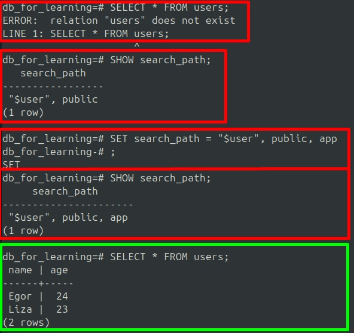

***Организация данных в PostgreSQL***  
  
**==================> Базы данных <==================**  
  
При инициализации кластера баз данных, PostgreSQL-сервер под капотом создает 3 стандартные базы данных:  
1. postgres  
2. template0  
3. template1  
  
Внутри базы данных postgres храняться системые таблицы. База данных postgres используется для системного администрирования. Две другие таблицы, как понятно из названия являются шаблонами.  
  
В PostgreSQL создание любой базы данных происходит путем копирования уже имеющейся. По умолчанию копирование новой таблицы происходит из пустой шаблонной базы **template1**. Соответственно, если нам необходимо использовать какие-либо объекты во всех вновь созданных таблицах, то нам достаточно создать эти объекты в базе данных template1.  
  
База данных template0 является полностью пустой. Такая таблица нужна для ряда важных целей, например, для осуществления резервного копирования. Копировать данные в PostgreSQL необходимо в полностью пустую таблицу, т.е. созданную на основе template0, а не template1, т.к. внутри template1 могут быть определенные объекты, которые будут тяжело совместимы с теми данными которые мы планируем вставить из резервной копии. Данная таблица хоть и необязательна, но весьмя полезна в ряде случаев. Учитывая тот факт, что данная таблица является пустой, логично сделать вывод, что её наличие не влияет негативно на производительность сервера, поэтому удалять ее не рекомендуется. *Также template0 может помочь нам создать базу, в которой мы хотим использовать кодировку символов отличную от кодировок по умолчанию*.  
  
Чтобы вывести список имеющихся в кластере баз данных необходимо выполнить:  
с хоста:  
```
    psql -l
```  
в терминальном окне psql:  
```
    \l
```  
Также список баз данных можно получить с помощью SQL-запроса из таблицы pg_database:  
```
    SELECT * FROM pg_database;
```  
При выводе результата данного запроса мы можем наблюдать дополнительную служебную информацию в столбцах:  
- datistemplate (t/f) - показывает ли база данных шаблонной  
- datallowconn (t/f) - показывает разрешено ли подключение к данной базе  
- datconnlimit - показывает лимит одновременных подключений к базе данных (значение -1 = лимита нет)  
  
Теперь попробуем создать базу данных копированием template1 и убедится, что все объекты доступные в template1 также доступны и в созданной на ее основе базе.  
Для начала подключимся к template1  
```
    \c template1
```  
Проверим доступна ли функция digest (из расширения pgcrypto), вычисляющая хеш-код текстовой строки:  
```
    SELECT digest('Hello, world!', 'md5');
```  
Очевидно, что в данном случае функция недоступна, т.к. расширение не установлено. Установим его с помощью:  
```
    CREATE EXTENSION pgcrypto;
```  
После установки расширения подключимся к другой БД, создадим новую базу данных и убедимся, что в ней доступно расширение установленное для template1:
```
    \c postgres
```  
```
    CREATE DATABASE my_db;
```  
*Также в данной команде можно явно указать базу на основе которой будет создана наша база данных с помощью конструкции **CREATE DATABASE my_db TEMPLATE название_базы_данных;***  
```
    \c my_db;
```  
```
    SELECT digest('Hello, world!', 'md5');
```  
Результат запроса покажет желаемый хеш.  
Теперь мы можем переименовать нашу базу, но только не из сеанса внутри этой базы. Т.е. нам нужно подключиться, например, к БД postgres и выполнить:
```
    ALTER DATABASE RENAME my_db TO db_for_learning;
```  
Мы также можем установить ограниченное кол-во одновременный подключений (поле datconnlimit) с помощью:
```
    ALTER DATABASE db_for_learning CONNECTION LIMIT 10;
```  
  
Размер БД можно узнать с помощью функции pg_database_size('название_БД')  
```
    SELECT pg_database_size('db_for_learning')
```  
Результат функции выводится в байтах. Для того чтобы получить размер БД в человеко-читаемом формате необходимо обернуть результат вызова функции pg_database_size() в функцию pg_size_pretty():  
```
    SELECT pg_size_pretty(pg_database_size('db_for_learning'))
```  
Т.к. на данный момент таблица пустая, она весит всего 7596 КБ  
  
**==================> Схемы <==================**  
  
Внутри любой базы данных, объекты, которые мы создаем, всегда принадлежат какой-либо схеме. Схемы в данном случае выступают в роли директорий, группирующих по определенным критериям объекты БД, а сами объекты, т.е. таблицы, функции, пользователи, представления - в роли файлов внутри этих директорий.  
  
В каждой БД, созданной на основе template1 находится схема под названием **pg_catalog**. Данная схема предназначена для хранения системных таблиц, например таких, как pg_database и pg_tables, а также для хранения представлений, функций и других системных объектов.  
  
Также внутри каждой БД, изначально, должна находится схема под названием **public**. Это схема предназначена для хранения созданных пользователем таблиц, для которых явно не была указана схема. Т.е. это своего рода универсальное хранилище таблиц в случае если при создании данных таблиц их не вложиил в конкретную схему.  
  
*Несмотря на то, что кластер баз данных в PostgreSQL способен обслуживать несколько БД, когда мы подключаемся, мы делаем это для конкретной базы данных. И как следствие можем выполнять запросы только к объектам той БД к которой мы подключены. Нельзя подключиться к БД postgres и выполнять запросы к таблице template1*  
  
Список схем можно узнать с помощью команды:
```
    \dn -- (describe namespace)
```  
  
Теперь создадим схему внутри нашей учебной базе данных db_for_learning:  
```
    CREATE SCHEMA app;
```  
Команда **\dn** теперь выводит только что созданную схему.  
Cоздадим таблицу *users* (по умолчанию она будет создана в схеме public):  
```
    CREATE TABLE users(
        name text,
        age integer
    );
```  
  
Чтобы вывести список таблиц необходимо выполнить команду:
```
    \dt
```  
В нашем случае вывод покажет, что таблица users создана в схеме public.  
  
Переносить объекты (например, таблицы) между схемами можно не переживая, т.к. сами данные остаются на диске там же где и лежали изначально. Единственное что происходит при смене схемы для таблицы - это в системном каталоге подправляются записи об этой таблице и о том, что она теперь принадлежит другой схеме.  
Чтобы заменить схему у таблицы необходимо выполнить команду:
```
    ALTER TABLE users SET SCHEMA app;
```  
В данный момент, если мы попробуем выполнить запрос к таблице users, без явного указания схемы app, т.е.
```
    SELECT * FROM users;
```  
то мы получим ошибку. Это ошибка говорить о том, что отношение к таблице users не существует. Возникает вопрос: "Как нам теперь работать с объектами, находящимися в разных схемах?". Ответом на этот вопрос является такое понятие как **путь поиска**.
  
**==================> Путь поиска <==================**  
  
Когда мы обращаемся к объекту с явным указанием пути до него, т.е. используя формат "схема.таблица", то используем так называемое "квалифицированное имя". Однако если мы обращаемся к нашему объекту без явного указания схемы, то PostgreSQL будет искать данный объект из списка схем, перечисленных внутри такого конфигурационного параметра, как search_path - путь поиска.  
```
    SHOW search_path;
```  
На данный момент, этот параметр содержит только одну схему. PostgreSQL последовательно ищет у каждой из схем, перечисленных внутри данного параметра через запятую, объект к которому мы совершаем запрос (в случае если название схемы не задано явно).  
*Реальный "путь поиска" может отличаться от того, что содержится в параметре search_path, т.к. к каким-то схемам включенным в search_path у пользователя просто может не быть прав доступа, или какая-то часть схем, указаных в search_path была удалена, но остались названия этих схем внутри параметра. Кроме того, некоторые системные схемы могут не явно добавляться в путь поиска*  
  
Для того чтобы узнать какой реальный путь поиска используется, необходимо воспользоваться вызовом функции current_schemas(), передав в нее в качестве параметра true/false.  
Отобразить только видимые схемы - false.  
Отобразить как видимые, так и скрытые - true  
```
    SELECT current_schemas(true);
```  
Описанное выше поведение касается лишь вопросов поиска объекта. Но не затрагивает процесс добавления объекта в БД. Т.е. например, если мы создали таблицу, то куда она будет помещена, в случае, когда явно не указана схема?  
Ответ достаточно прост - в первую схему из "пути поиска" куда у текущего пользователя есть права записывать объекты. В нашем случае это схема public. *Cхема public по умолчанию входит в search_path.*  
  
Создание таблицы с явным указанием схемы:
```
    CREATE TABLE app.users(
        name text,
        age integer
    );
```  
  
Особое значение есть также у схемы, соответствующей имени пользователя, под которым осуществлено подключение. Если такая схема создана, то она имеет приоритет выше чем схема public на запись и чтение из нее таблиц. Т.е. если под пользователем owner мы создадим схему owner, то созданные обекты базы данных буду попадать не в схему public, а в схему owner. Следовательно, если данная схема создана, то она будет выписана в search_path перед схемой public. Проверим это на практике. Запустим:  
1. В терминальном окне psql:  
```
    CREATE SCHEMA owner; -- создадим схему соответствющую имени пользователя под которым планируем подключение
    SELECT current_schemas(false); -- выведем реальный путь поиска для пользователя postgres (отображается только схема public, т.к. owner и app не добавлены в search_path)
```  
*По умолчанию параметр search_path содержит в себе значение **{"$user",public}**. Конструкция "$user" - это динамически сгенерированная строка, содержащая имя текущего пользователя. Т.е. для owner параметр search_path = **{owner,public}**, а для postgres параметр search_path = **{postgres,public}***  
*Создаем схему owner под пользователем postgres, т.к. у owner нет прав создания схем в данной БД (db_for_learning). Исправлю это позже, когда изучу права доступа.*  
2. С хоста зайдем в psql под пользователем owner:  
```
    psql -U owner -d db_for_learning -- зайдем в psql под пользователем owner
```  
Теперь внутри терминального окна выполним:  
```
    CREATE TABLE table_for_owner; -- создадим таблицу без явного указания схемы
    SELECT current_schemas(false); -- выведем реальный путь поиска для пользователя owner (отображается схема owner и после нее схема public, т.к. сейчас мы подключены под пользователем owner)
    \dt -- убедимся, что для таблицы table_for_owner установлена схема owner
```  
  
Как было сказано ранее, некоторые системные схемы не явно подставляются в реальный путь поиска. Например, схема pg_catalog подставляется в search_path первой, если явно не указана в search_path. Чтобы в этом убедиться, необходимо вывести результат вызова функции current_schemas() с параметром true (т.е. отобразить скрытые схемы):  
```
    SELECT current_schemas(true);
```  
  
Вывод будет примерно следующим: **{pg_catalog,owner,public}**  
  
Конфигурационный параметр search_path можно изменить с помощью:
```
    SET search_path = "$user", public, app
```  
  
Теперь, т.к. мы добавили в "путь поиска" схему app, запрос данных из таблицы users, лежащей в этой схеме, будет выполнен даже без явного указания схемы (т.к. рано или поздно PostgreSQL в пути поиска найдет данную схему и вернет из нее данные таблицы users)  
  
  
  
Т.к. нам часто придется работать с различными базами данных, то логичным является тот факт, что придется совершать команду:
```
    SET search_path = "$user", public, ...
```  
При подключении к каждой новой базе данных. Есть некоторые способы решения данной проблемы:
1. **Захардкодить данный параметр в postgresql.conf**. Нам не придется задавать вручную данный параметр, но тогда нам придется переписывать данный параметр в postgresql.conf при каждой смене подключения к БД.  
2. **Задать данный параметр для конкретного пользователя в файле .psqlrc** с помощью \set SEARCH_PATH '"$user", public, ...', но тогда нам все равно придется переписывать файл .psqlrc при смене БД под конкретным пользователем. Правда это скорее всего придется делать реже чем при способе описанном в п.1  
3. **Задать данный параметр для конкретной БД**. В таком случае независимо от того под каким пользователем и в какую БД мы подключились, мы все равно будем получать актуальный для этой БД и её схем параметр search_path. Для этого необходимо выполнить команду:  
```
    ALTER DATABASE db_for_learning SET search_path = "$user", public, app
```  
***Важно выполнять эту команду при текущем подключении к другой БД. В противном случае ничего не сработает***  
Данная команда не мешает нам поменять данный параметр во время сеанса, она просто выполняется при каждом подключении к БД. Соответственно, если параметр был изменен в текущем сеансе и не записан с помощью данной команды, то при повторном подключении его значение останется таким, каким было до изменения (т.е. таким, каким его определяет **ALTER DATABASE db_for_learning SET search_path = ...**)  
  
**==================> Специальные схемы <==================** 
  
Временные таблицы - это таблицы, которые создаются на время транзакции или конкретного сеанса. *Важно помнить, что данные таблицы не журналируются в WAL, поэтому их восстановление, в случае аварии, невозможно*  
Данные таблицы имеют название в формате pg_temp_N, где N - номер данной таблицы. Каждый сеанс создает свою собственную таблицу.  
  
Если мы хотим обратитсья к временной таблице используя квалифицированное имя, то нам в рамках текущего сеанса необходимо обращаться к схеме **pg_temp**, т.к. как эта схема содержит все временные таблицы внутри себя. Особенность данной схемы в том, что даже если мы не вписываем ее явно в "путь поиска", то она все равно всегда добавляет туда в самое начало.  
  
Чтобы создать временную таблицу необходимо воспользоваться командой:
```
    CREATE TAMP TABLE my_temp_table (
        number integer
    );
```  
Теперь мы видим, что данная таблица добавлена в схему pg_temp_3:
```
    \dt
```  
  
Если мы выведем текущий реальный "путь поиска", то увидим, что данная схема занимает первое место в нём  
```
    SELECT current_schemas(true);
```  
Мы также можем пользоваться квалифицированным именем, явно обращаясь к таблице my_temp_table:
```
    SELECT * FROM pg_temp_3.my_temp_table;
```  
или вот так:
```
    SELECT * FROM pg_temp.my_temp_table;
```  
  
Если мы хотим удалить схему, то на запрос:
```
    DROP SCHEMA app;
```  
мы получим сначала получим предупреждение о том, что нельзя удалить данную схему, т.к. в ней всё еще есть определенные объекты. Если нам все равно необходимо удалить схему включая ее содержимое, то необходимо использовать ключевое слово **CASCADE**:
```
    DROP SCHEMA app CASCADE;
```  
*Для того чтобы удалить базу данных, нужно предварительно переключиться на другую БД.*