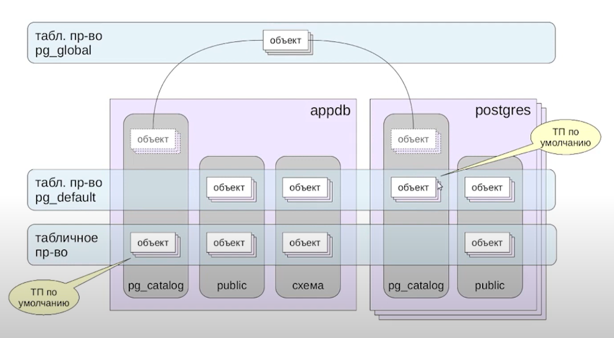

***Табличные пространства. Физическая организация данных***  
  
**==================> Табличное пространство <==================**  
  
Табличное пространство - это способ физической органзиации данных.  
  
По сравнению с схемами, которые объединяют таблицы данных в логические группы, табличные пространства представляют собой физическую область памяти на дисковых массивах. Условное табличное пространство - это директория на диске, поэтому в рамках одного табличного пространства мы можем хранить таблицы из разных баз данных.  
  
В момент инициализации кластера создаются два стандартных табличных пространства - pg_clobal и pg_default.  
1. pg_global - содержит общие для всего кластера объекты (например, pg_database).
2. pg_default - табличное пространство по умолчанию.  
  
Любая БД имеет одно табличное пространство по умолчанию и хранит внутри данного табличного пространства системные объекты схемы pg_catalog.  
  
Именно такой БД по умолчанию и выступает pg_default. В случае если табличное пространство по умолчанию переназначается, системные объекты схемы pg_catalog переносятся в новое табличное пространство.  
  
  
  
Пусть наш кластер находится по пути указанному в переменной PGDATA (/home/owner/data_postgresql). Табличные пространства также имеют определенный стандарт указания пути, по которому должны храниться директории, представляющие собой сами табличные пространства. Так например, табличное пространство:  
1. pg_global хранится по пути **PGDATA/global/**  
2. pg_default хранится в каталоге **PGDATA/base/** и для каждой отдельной БД содержит подкаталог с названием равным OID данной БД, т.е. **PGDATA/base/db_for_learning**  
3. созданное нами лично, находится в том каталоге, в которым нам необходимо, например, в **/home/owner/my_tablespace**. Также необходимо в данном каталоге указать подкаталог с номером версии PostgreSQL и подкаталог с OID базы данных, данные из которой планируется хранить в данном табличном пространстве, а именно **/home/owner/my_tablespace/16/40998**, т.к. для БД db_for_learning, OID = 40998.  
  
*Важно заметить, что на табличные пространства, созданные нами самостоятельно, PostgreSQL создает символические ссылки, которые храняться по пути **/PGDATA/pg_tblspc/OID_базы_данных***  
  
Табличные пространства помогают более гибко управлять даннными и процессом их хранения. Например, для данных, которые часто используются и нам важна их быстрая запись и чтение, мы можем использовать табличное пространство монтированное с новенького SSD-диска, а те данные, которые не особо часто нам нужны, мы можем просто хранить в табличном пространстве с обычного HDD.  
  
Для отображения текущих табличных пространств необходимо выполнить запрос:
```
    SELECT * FROM pg_tablespace;
```  
  
Чтобы создать свое табличное пространство, необходимо:  
1. создать каталог на необходимом диске  
2. владельцем этого каталога сделать пользователя postgres  
3. создать табличное пространство SQL-запросом внутри psql  
  
На хосте:  
```
    mkdir /home/owner/Desktop/owner/postgresql_learning/my_tablespace
    chowm postgres /home/owner/Desktop/owner/postgresql_learning/my_tablespace
```
  
В psql:  
```
    CREATE TABLESPACE my_ts LOCATION '/home/owner/Desktop/owner/postgresql_learning/my_tablespace';
```  
  
Теперь для того чтобы отобразить текущие табличные пространства можно также использовать встроенную команду psql вместо обращения к таблице pg_tablespace
```
    \db
```  
  
Теперь чтобы задать данную таблицу по умолчанию для конкретной БД, необходимо при создании данной БД указать дополнительно:
```
    CREATE DATABASE sobachka TABLESPACE название_табличного_пространства;
```  
  
Если нам необходимо при создании таблицы указать табличное пространство для ее хранения, то мы также после команды "CREATE TABLE ..." добавляем указание "...**TABLESPACE pg_default**":
```
    CREATE TABLE new_table (
        name text,
        age integer
    ) TABLESPACE pg_default;
```  
  
Теперь если мы обращаемся к таблице pg_tables, то увидим, что поле tablespace у некоторых таблиц ничем не заполнено. Пустое поле означает, что для данной таблицы используется табличное пространство заданное по умолчанию. Важно, что для того чтобы вывести имена таблиц и табличные пространства, в которых храняться данные таблицы, необходимо обращаться именно к таблице pg_tables, использование **\dt** или **\dt+** не выводит табличные пространства.  
  
```
    CREATE TABLE mur (
        id integer,
        name text
    ) TABLESPACE my_ts;
```
  
```
    SELECT tablename, tablespace FROM pg_tables;
```  
  
В ходе работы с кластером PostgreSQL, может потребоваться перенести данные (таблицы) из одного табличного пространства в другое. В отличие от изменения схем, изменение табличного пространства - это процесс ресурсоемкий, т.к. предполагает физическое изменения местоположения всех данных в таблице. На данный момент у нас есть таблица "**mur**" внутри табличного пространства "**my_ts**". Попробуем перенести ее в табличное пространство pg_default. Для этого используем:
```
    ALTER TABLE mur SET TABLESPACE pg_default;
```
  
Если нам необходимо удалить табличное пространство, то сделать это нужно, предварительно удалив все содержащиеся в табличном пространстве объекты. Аналога ключевого слова **CASCADE**, как в примере с удалением схемы, к сожалению, в данном случае нет. Для того чтобы не удалять или переносить все объекты вручную, можно использовать команду:  
```
    ALTER TABLE ALL IN TABLESPACE my_ts SET TABLESPACE another_ts;
```
  
*Данная команда перекинет все таблицы из табличного пространства "my_ts" в табличное пространство "another_ts", после чего можно удалить пустое табличное пространство*  
  
Также нужно понимать, что в рамках одного табличного пространства могут находится объекты различных баз данных. Чтобы вручную удалить объекты из табличного пространства нам необходимо:  
1.  Узнать и запомнить идентификатор нашего табличного пространства:  
```
    -- По названию табличного пространства
    SELECT oid FROM pg_tablespace
    WHERE spcname = 'my_ts';
    
    -- Через название таблицы хранящейся в данном табличном пространстве
    SELECT tablespace FROM pg_tables 
    WHERE tablename = 'table_from_my_ts';
```  
Результат: **65537**  
  
2. Получить массив баз данных, объекты которых содержаться в табличном пространстве, которые мы планируем удалить с помощью функции pg_tablespace_databases(oid). Данная функция возвращает массив OID баз данных:  
```
    SELECT pg_tablespace_databases(65537);
```  
  
3. Перевести данные в человеко-читаемый формат:  
```
    SELECT datname FROM pg_database 
    WHERE oid IN (SELECT pg_tablespace_databases(65537));
```
  
Результат:  
1. **db_for_learning**  
2. **new_db**  
  
4. Подключится к полученным таблицам и удалить объекты из табличного пространства. Опеределить какие именно объекты принадлежат в текущей базе данных табличному пространству, которое планируется удалить, можно с помощью запроса к pg_class:  
```
    \c db_for_learning
```  
```
    SELECT * FROM pg_tables
    WHERE tablespace = 'my_ts';
```  
  
Затем то же самое нужно проделать для **new_db**  
  
*Стоит заметить, что для тех баз данных, для которых данная табличное простарнство было задано по умолчанию, объекты системного каталога находятся в данном табличном пространстве, даже если явно никакие объекты в pg_class не имеют reltablespace равный тому OID, который присвоен нашему табличному пространству. В данных базах данных, объекты системного каталога храняться в специальном формате (как будто в табличном пространстве с OID = 0):*  
```
    SELECT count(*) FROM pg_class
    WHERE reltablespace = 0;
```  
  
Для того чтобы удалить табличное пространство, необходимо убедиться, что в базе данных, для которой данное табличное пространство задано по умолчнию, также не осталось объектов, принадлежащих текущему табличному пространству.  
  
Для того чтобы узнать размер табличного пространства нужно воспользоваться функцией **pg_tablespace_size('название_табличного_пространства')**. Чтобы отобразить данные в человеко-читаемом формате необходимо обернуть вызов данной функции, функцией pg_size_pretty():  
```
    SELECT pg_size_pretty(pg_tablespace_size('my_ts'));
```
  
Данную информацию также можно посмотреть с помощью:
```
    \db+
```